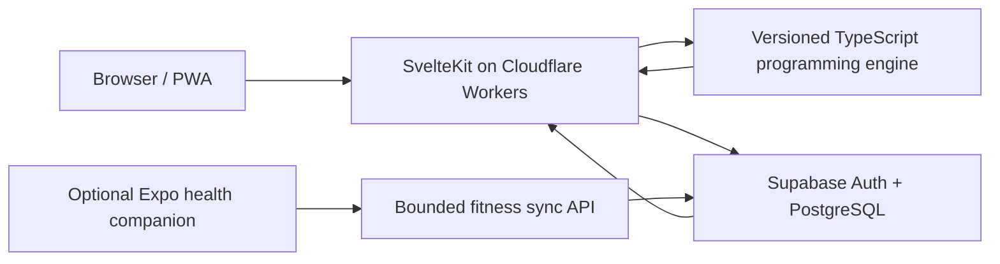

# Orbital Training

[](https://github.com/m-lutter/orbital-training/actions/workflows/ci.yml)

**A production-deployed, adaptive strength and conditioning planner.** Orbital
turns an athlete's goals, experience, schedule, equipment, recovery, and safety
constraints into a specific dated program, then carries that plan through workout
logging and conservative weekly adaptation.

[Open the live beta](https://orbital-training.com) · Current release:
`0.0.1-beta.10` · Programming engine: `0.12.0`

## What this project demonstrates

- A deterministic, versioned TypeScript programming engine—not an opaque model
  call—with traceable policy metadata and explicit `ready`, `needs_input`, and
  `infeasible` outcomes.
- Constraint-aware scheduling across arbitrary start weekdays, event dates,
  equipment availability, recovery limits, and concurrent strength/cardio goals.
- Specific prescriptions for sets, reps, effort, rest, and implement-rounded load
  when the available baseline supports one. User-facing plans stay concrete even
  when controlled substitutions or adjustments are allowed.
- Durable workout execution: autosave, optimistic revisions, server-side finish
  validation, supersets, timers, shortened-session options, pain/technique
  check-ins, and temporary or permanent lift substitutions.
- Cardio-modality switching that preserves the intended time, effort, and interval
  structure while removing pace, distance, or heart-rate targets that do not
  transfer safely to the new modality.
- Immutable completed history and future-only weekly adaptation, including
  backwards-compatible parsing of earlier saved program versions.
- Production boundaries around authentication, row-level security, bounded
  payloads, encrypted provider tokens, security headers, data retention, account
  export, and account deletion.

## Product capabilities

- Guided onboarding for powerlifting, hypertrophy, cardio, and general-fitness
  priorities.
- Calendar-anchored multi-week programs with explicit workout dates and event
  cutoffs.
- Strength, accessory, superset, interval, and steady-state cardio prescriptions.
- Workout logging with plate math, rest timers, progress persistence, and a
  dedicated completion summary.
- Weekly reviews that adjust only future work while preserving what the athlete
  actually completed.
- Responsive PWA experience with two visual themes.
- Optional Google Health/Fitbit import and an experimental Expo companion for
  Apple Health and Android Health Connect.

## Architecture



The domain layer is deliberately separated from route and persistence code. Program
generation and adaptation are pure, deterministic operations; SvelteKit owns HTTP
and UI orchestration; PostgreSQL functions and row-level-security policies enforce
the durable multi-user boundary.

## Engineering decisions

### Specificity without false precision

The UI always presents one actionable prescription. The engine emits an exact
implement-rounded load only when it has a suitable baseline; otherwise it uses a
specific effort target and records why a load could not be justified.

### Fail-closed programming

Unresolved safety restrictions or impossible schedule constraints return a typed
non-ready result rather than silently generating a compromised plan. Cross-program
invariants validate dates, exercise identity, dose, and progression before a plan
can be persisted.

### Stable history, bounded adaptation

Completed workouts are immutable. Weekly reviews can change future sessions, but
adaptations are capped, attributed to a versioned policy, and stored with an audit
trail. Wearable recovery signals can pause an increase; they cannot independently
reduce training.

### Concurrency-aware persistence

Workout saves use optimistic revisions and a single-flight server path so rapid
autosaves, explicit exits, and completion requests cannot overwrite newer work or
leave the UI in an ambiguous state.

## Technology

| Area             | Implementation                                                               |
| ---------------- | ---------------------------------------------------------------------------- |
| Web              | Svelte 5, SvelteKit 2, TypeScript 6, Vite                                    |
| Runtime          | Cloudflare Workers                                                           |
| Data             | Supabase Auth, PostgreSQL, row-level security, versioned migrations and RPCs |
| Testing          | Vitest, Playwright browser components, Playwright E2E, pgTAP                 |
| Quality          | ESLint, Prettier, Svelte checks, generated Worker types, performance budgets |
| Native companion | Expo, React Native, HealthKit, Health Connect                                |

## Repository map

| Path                   | Purpose                                                                     |
| ---------------------- | --------------------------------------------------------------------------- |
| `src/lib/domain/`      | Current generation, scheduling, substitution, safety, and adaptation policy |
| `src/lib/engine/`      | Engine boundary and compatibility support for older program payloads        |
| `src/routes/`          | SvelteKit pages, actions, and API endpoints                                 |
| `supabase/migrations/` | Versioned database schema, functions, policies, and performance changes     |
| `supabase/tests/`      | Database security, isolation, lifecycle, and persistence contracts          |
| `tests/e2e/`           | Authenticated product journeys and release-surface checks                   |
| `mobile-health-sync/`  | Optional native Apple Health / Health Connect bridge                        |
| `.github/workflows/`   | Application, browser, E2E, and database quality gates                       |

## Local development

### Prerequisites

- Node.js 24 and npm
- Docker, when running the local Supabase stack or full-stack tests

Install dependencies:

```sh
npm ci
```

Start local Supabase and inspect its generated environment values:

```sh
npx supabase start
npx supabase status -o env
```

Copy `.env.example` to `.env.local`, then set the local `API_URL` as
`PUBLIC_SUPABASE_URL` and the local `PUBLISHABLE_KEY` as
`PUBLIC_SUPABASE_PUBLISHABLE_KEY`. Start the application with:

```sh
npm run dev
```

The application can be developed without enabling fitness providers. These values
are server-only and optional unless that integration is being exercised:

| Variable                       | Purpose                                                   |
| ------------------------------ | --------------------------------------------------------- |
| `SUPABASE_SERVICE_ROLE_KEY`    | Server-side fitness persistence                           |
| `FITNESS_TOKEN_ENCRYPTION_KEY` | Encryption key for provider tokens; minimum 32 characters |
| `GOOGLE_HEALTH_CLIENT_ID`      | Google Health OAuth client identifier                     |
| `GOOGLE_HEALTH_CLIENT_SECRET`  | Google Health OAuth client secret                         |

Never prefix server secrets with `PUBLIC_` or place them in committed files. The
native companion has separate setup instructions in
[`mobile-health-sync/README.md`](mobile-health-sync/README.md).

## Verification

Run the same primary checks used by CI:

```sh
npm run verify
npm run test:client
```

With local Supabase running:

```sh
npm run test:database
npm run test:e2e
```

Useful focused commands include `npm run test:server`, `npm run check`,
`npm run lint`, and `npm run check:budgets`.

## Current status and limitations

- Orbital is an open beta. Saved-data compatibility is maintained, but product and
  programming-policy changes are still expected.
- The programming rules and their evidence metadata are engineering controls, not
  proof that the integrated system is clinically validated or optimal for every
  athlete.
- Orbital is intended for healthy adults and is not medical advice. Safety-related
  uncertainty blocks automated programming and directs the user to qualified care.
- The native health companion requires a custom signed/development build and
  physical-device validation before store distribution. It does not promise
  continuous background or watch-native telemetry.

## Portfolio notice

Built by Maxwell Lutter as an end-to-end product engineering project spanning
domain modeling, full-stack implementation, database design, production operations,
and release validation.

No open-source license is currently granted. The repository is available for
portfolio review; add an explicit license before reusing or redistributing its code
or visual assets.
